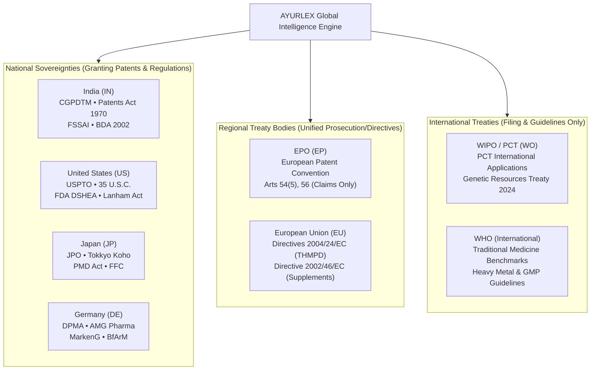

# AYURLEX Jurisdiction & System Coverage Matrix
**Document ID:** REP-JUR-COV-V2  
**Standard:** Legal System Architecture for Traditional Knowledge & Global IP  

---

## 1. System Taxonomy: Clarifying Legal Realities

In international IP law, confounding jurisdictions leads to severe legal errors. AYURLEX strictly enforces the distinction between **National Sovereign States**, **Regional Treaty Systems**, and **International Filing Mechanisms**:

### Critical Legal Distinctions Enforced in AYURLEX:
1. **`WO` is NOT a country**:
   - `WO` represents International Patent Applications filed under the **Patent Cooperation Treaty (PCT)** administered by **WIPO**.
   - WIPO does **NOT** grant patents; patents are granted only upon entry into national/regional phases.
2. **`EP` is NOT European Union (`EU`) Regulation**:
   - The **European Patent Organisation (EPO)** is an independent intergovernmental body operating under the European Patent Convention (EPC).
   - EPO handles **patent prosecution** (novelty, inventive step, industrial application).
   - Food and drug regulations (THMPD, EFSA health claims) are governed by the **European Union (EU)**, not the EPO.
3. **`IN` Multi-Agency Jurisdictional Framework**:
   - India's AYUSH ecosystem is governed by distinct statutory bodies:
     - **CGPDTM**: Patents (Patents Act 1970), Trademarks (1999), GIs (1999).
     - **AYUSH Ministry & State Licensing Authorities**: Drug licensing under Drugs & Cosmetics Rules 158B.
     - **FSSAI**: Food supplements under Ayurveda Aahara Regulations 2022.
     - **National Biodiversity Authority (NBA)**: Access and Benefit Sharing under BDA 2002 Sec 6.

---

## 2. Jurisdiction Coverage & Production Status

| Jurisdiction / System | Type | Indexed Chunks | Authority Tier | Status | Search Modalities Supported |
| :--- | :--- | :--- | :--- | :--- | :--- |
| **India (`IN`)** | National | 137 Canonical + 108 Multi-Domain | Tier 1 (Statutory & Granted) | **Fully Supported** | Dense FAISS, BM25 Okapi, Cross-Encoder, Cross-Lingual (`ja`, `hi`, `te`, `ta`) |
| **United States (`US`)** | National | 29,003 Chunks | Tier 1 (USPTO Grants/Pubs) | **Fully Supported** | Dense FAISS, BM25 Okapi, Cross-Encoder |
| **Japan (`JP`)** | National | 26,041 Chunks | Tier 1 (JPO Kokai) | **Fully Supported** | Dense FAISS, BM25 Okapi (Japanese Tokenized), Cross-Lingual to English/Hindi |
| **WIPO / PCT (`WO`)** | International | 13,652 Chunks | Tier 1 (PCT Applications) | **Fully Supported** | Dense FAISS, BM25 Okapi, Cross-Encoder |
| **EPO (`EP`)** | Regional | 1,912 Chunks | Tier 1 (EPO Bulletin Claims) | **Fully Supported** | Dense FAISS, BM25 Okapi, Cross-Encoder |
| **European Union (`EU`)** | Regional | 47 Specialized Chunks | Tier 1 (Directives & EFSA) | **Partially Supported** | Semantic Retrieval via Specialized Knowledge Store |
| **Germany (`DE`)** | National | 15 Dedicated Chunks | Tier 1 (AMG, DPMA, MarkenG) | **Partially Supported** | German Dedicated Store & Cross-Lingual Routing |
| **Australia (`AU`)** | National | 0 Chunks | N/A | **Requires Live Official Search** | Abstention trigger; guides user to TGA ARTG public register |
| **Restricted TKDL** | Confidential Vault | 0 Chunks | Tier 1 (Restricted) | **Requires Authorized Access** | Refusal trigger; explains non-disclosure constraints |
